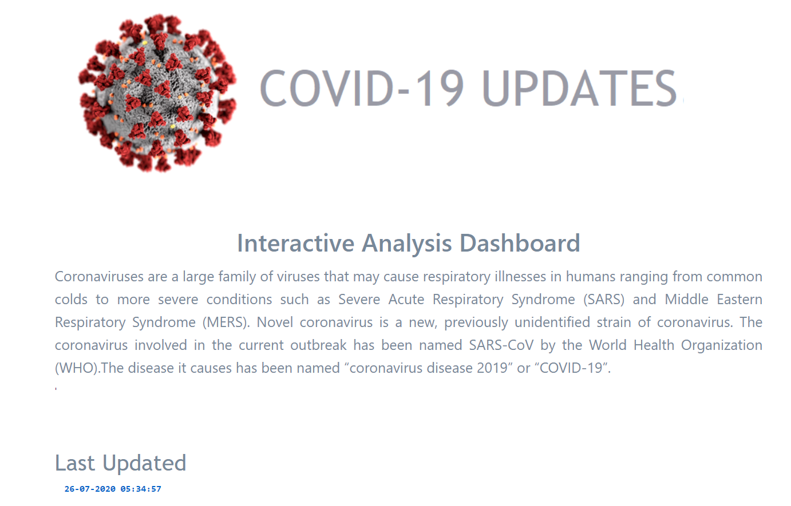
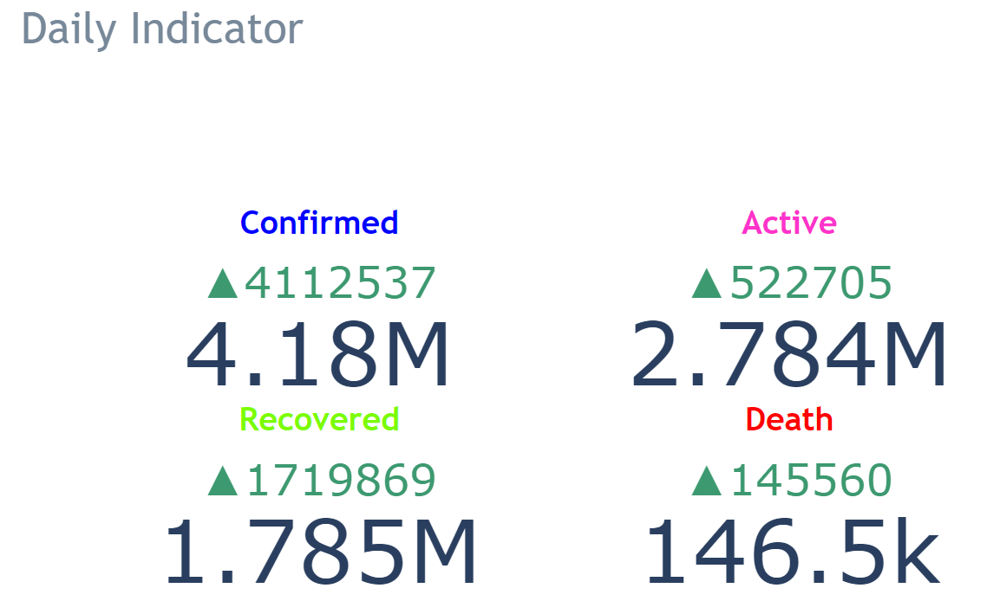
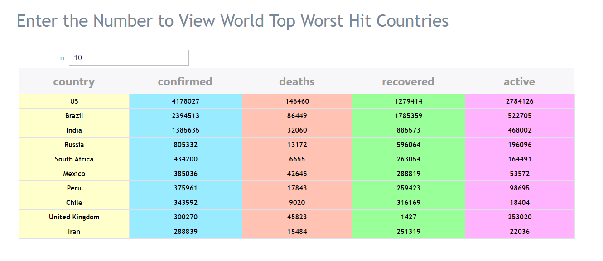
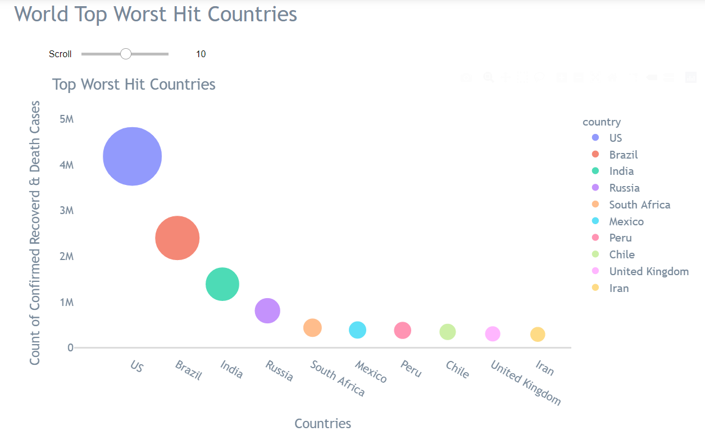
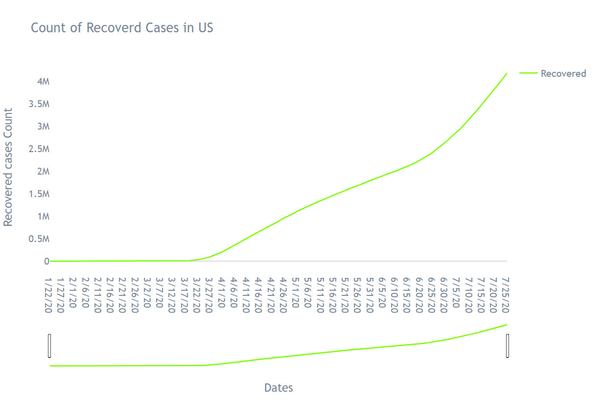

COVID-19 WORLD INTERACTIVE DASHBOARD

# Creating a dashboard out of your jupyter notebook without writing any fronted or backed code.

# Source Data  
John Hopkins Repository https://github.com/CSSEGISandData/COVID-19/tree/master/csse_covid_19_data/csse_covid_19_time_series 

# Skills 
python - plotly, ipywidgets, folium, voila

# Output

